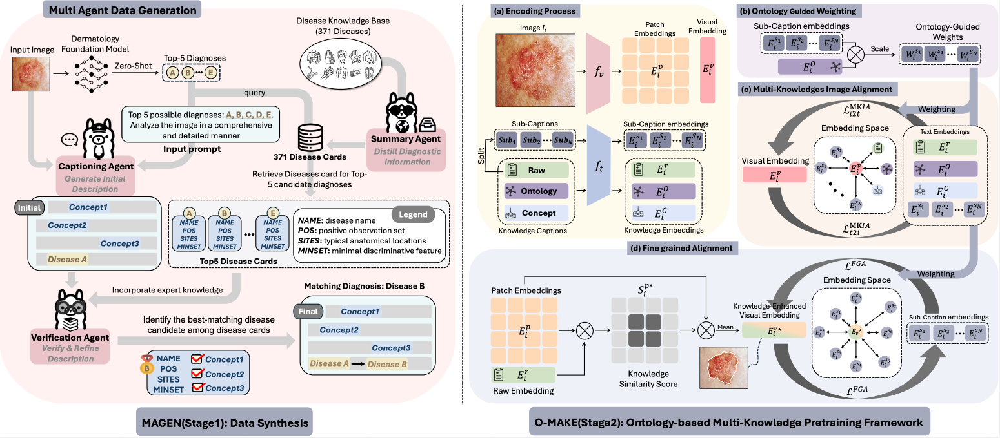

# MAGEN-O-MAKE

Multi-Aspect Knowledge-Enhanced Medical Vision-Language Pretraining with Multi-Agent Data Generation

<p align="center">
  <a href="https://arxiv.org/abs/2512.03445"></a>
  <a href="https://huggingface.co/Xieji-Li/MAGEN-O-MAKE"></a>
  
</p>

## Abstract

We propose a novel medical VLP framework combining **MAGEN** (Multi-Agent data GENeration) and **O-MAKE** (Ontology-based Multi-Aspect Knowledge-Enhanced pretraining). MAGEN synthesizes knowledge-enriched image descriptions via a foundation model-assisted captioning and retrieval-based verification pipeline. O-MAKE decomposes long clinical texts into distinct knowledge aspects, enabling fine-grained alignment at both global and patch levels with ontology-guided modeling. Validated on dermatology, our approach achieves state-of-the-art zero-shot performance on disease classification and cross-modal retrieval across eight datasets.

<p align="center">
     <br>
</p>

## Updates

- [x] Released the O-MAKE checkpoint and the zero-shot, linear-probing, and fine-tuning pipelines.
- [ ] The augmented dataset **Derm1M-AgentAug** (400K+ skin image-text pairs) will be released upon acceptance.

## Repository layout

```
├── src/                        O-MAKE pretraining + zero-shot evaluation
│   ├── main.py                   pretraining entry point
│   ├── test.py                   zero-shot disease classification
│   ├── open_clip/                model definitions (vendored open_clip fork)
│   └── open_clip_train/          losses, data, ontology sampler, eval
├── linear_probe/               frozen-encoder linear probing
├── finetune/                   end-to-end fine-tuning
├── meta/downstream/            train/val/test splits for probing & fine-tuning
├── script/                     one command per experiment
└── data/                       downstream images (downloaded separately)
```

## Environment

```bash
conda create -n omake python=3.10
conda activate omake
git clone https://github.com/XiejiLi/MAGEN-O-MAKE.git
cd MAGEN-O-MAKE
pip install -r requirements.txt
```

Install the PyTorch build that matches your CUDA version first if the default wheel does not suit
your driver. The pipelines were verified with `torch 2.4-2.7` and `timm 0.9.16-1.0.15`; `open_clip`
itself is vendored under `src/open_clip`, so no separate `open_clip_torch` install is needed.

## Pretrained model

| Model | Architecture | Weights |
|---|---|---|
| O-MAKE | CLIP ViT-B/16 | [🤗 Xieji-Li/MAGEN-O-MAKE](https://huggingface.co/Xieji-Li/MAGEN-O-MAKE) |

### Quick start

```python
import torch
from PIL import Image
import open_clip   # pip install open_clip_torch

model, preprocess = open_clip.create_model_from_pretrained('hf-hub:Xieji-Li/MAGEN-O-MAKE')
tokenizer = open_clip.get_tokenizer('hf-hub:Xieji-Li/MAGEN-O-MAKE')

labels = ['melanoma', 'basal cell carcinoma', 'nevus', 'seborrheic keratosis']
image = preprocess(Image.open('lesion.jpg').convert('RGB')).unsqueeze(0)
text = tokenizer([f'This is a skin image of {c}' for c in labels])

with torch.no_grad():
    image_features = model.encode_image(image)
    text_features = model.encode_text(text)
    image_features /= image_features.norm(dim=-1, keepdim=True)
    text_features /= text_features.norm(dim=-1, keepdim=True)
    probs = (100.0 * image_features @ text_features.T).softmax(dim=-1)

print(dict(zip(labels, probs[0].tolist())))
```

To reproduce the numbers below instead, download `O-MAKE_epoch_15.pt` from the same Hugging Face
repository into `checkpoints/` and use the scripts in `script/`:

```bash
mkdir -p checkpoints
hf download Xieji-Li/MAGEN-O-MAKE O-MAKE_epoch_15.pt --local-dir checkpoints
```

## Data preparation

Download the downstream evaluation datasets from
[Google Drive](https://drive.google.com/file/d/1QysyixFNW3F7XmOOHkUczkvSlXV6qavc/view?usp=sharing),
unzip, and place the contents in `data/`:

```
data
├── Daffodil/   ├── ISIC2018/   ├── SD-128/   └── SNU/
├── F17K/       ├── PAD/        ├── SD-198/
```

Each dataset ships a metadata CSV whose `filename` column is a path relative to the repository root,
so all commands below are run from the repository root. The `meta/downstream/*-LP.csv` files in this
repository add the train/val/test splits used by linear probing and fine-tuning.

## Zero-shot disease classification

```bash
bash script/zeroshot_eval.sh
```

`src/test.py` takes one `--eval-<dataset>` flag per benchmark, so you can evaluate any subset:

```bash
python src/test.py \
    --model ViT-B-16 --resume checkpoints/O-MAKE_epoch_15.pt \
    --batch-size 512 --csv-img-key filename --csv-label-key label \
    --eval-pad data/PAD/MAKE_PAD.csv \
    --eval-sd-tails data/SD-198/SD-tails-70.csv
```

Run `python src/test.py --help` for the full list of benchmarks.

### Results

Produced by `bash script/zeroshot_eval.sh` with the released checkpoint, using the 8-template prompt
ensemble (`OPENAI_SKIN_TEMPLATES`):

| Benchmark | Classes | Metric | Score |
|---|---|---|---|
| PAD-UFES-20 | 6 | AUROC / Accuracy | 0.9176 / 0.6675 |
| Fitzpatrick17K | 113 | Top-1 / Top-5 | 0.3716 / 0.6620 |
| SNU | 134 | Top-1 / Top-5 | 0.3898 / 0.7235 |
| SD-128 | 128 | Top-1 / Top-5 | 0.4595 / 0.7711 |
| Daffodil | 5 | Top-1 | 0.8321 |
| SD-tails (SD-198 \ SD-128) | 70 | Top-1 / Top-5 | 0.5565 / 0.8301 |
| SNU-tails (<15 samples/class) | 85 | Top-1 / Top-5 | 0.4573 / 0.7882 |

The last two rows are long-tail splits covering rare conditions.

## Linear probing

Freezes the image encoder, extracts features, and fits logistic regression on top:

```bash
bash script/linear_probe.sh
python linear_probe/sort_script.py logs/linear_probe     # summary table
```

To probe a baseline encoder instead, point `MODEL` at any open_clip name and leave `CHECKPOINT` empty:

```bash
MODEL='open_clip_hf-hub:redlessone/DermLIP_ViT-B-16' CHECKPOINT='' bash script/linear_probe.sh
MODEL='open_clip_ViT-B-16' CHECKPOINT='' bash script/linear_probe.sh   # OpenAI CLIP
```

## Fine-tuning

End-to-end fine-tuning of the vision tower with a linear classification head:

```bash
bash script/finetune.sh                  # PAD, F17K, SNU, SD-128, Daffodil, ISIC2018
DATASETS='PAD' bash script/finetune.sh   # a single dataset
```

Fine-tuning logs to Weights & Biases; export `WANDB_MODE=offline` to run without an account.

## Pretraining

```bash
bash script/pretrain.sh
```

This reproduces the released checkpoint: CLIP ViT-B/16 initialised from OpenAI weights, 15 epochs at
batch size 2048, with multi-aspect knowledge contrastive learning (`--MKCL --subcaptions
--num_subcaptions 8`) and ontology-guided hierarchical contrastive learning (`--OHCL --OHCL_temp 0.07
--OHCL_beta 0.5 --loss_type KL`).

The MAGEN-augmented pretraining corpus (**Derm1M-AgentAug**) is not yet public. The script expects a
CSV with one row per image-text pair and these columns:

| Column | Description |
|---|---|
| `filename` | image path relative to the repository root |
| `truncated_caption` | MAGEN-generated caption, split into `--num_subcaptions` knowledge aspects |
| `label` | disease label, used for the disease-specific aspect weighting |

The ontology asset used by O-MAKE ships with the code:
`src/open_clip_train/ontology/ontology_distance.npy` holds the precomputed pairwise distances in the
Derm1M disease hierarchy, and drives both the hierarchical contrastive loss and the ontology sampler.

## License

Released under [CC BY-NC-ND 4.0](https://creativecommons.org/licenses/by-nc-nd/4.0/) for
non-commercial research use. This is a research artifact, **not a medical device**: it must not be
used for diagnosis, triage, or any other clinical decision-making.

## Acknowledgements

Built on [open_clip](https://github.com/mlfoundations/open_clip). The pretraining corpus derives from
[Derm1M](https://github.com/SiyuanYan1/Derm1M); the linear-probing and fine-tuning harnesses are
adapted from [PanDerm](https://github.com/SiyuanYan1/PanDerm), and this work extends
[MAKE](https://github.com/SiyuanYan1/MAKE) (MICCAI'25).

## Citation

```bibtex
@article{magenomake2025,
  title   = {Multi-Aspect Knowledge-Enhanced Medical Vision-Language Pretraining with Multi-Agent Data Generation},
  author  = {TODO: fill in the author list},
  journal = {arXiv preprint arXiv:2512.03445},
  year    = {2025}
}
```
